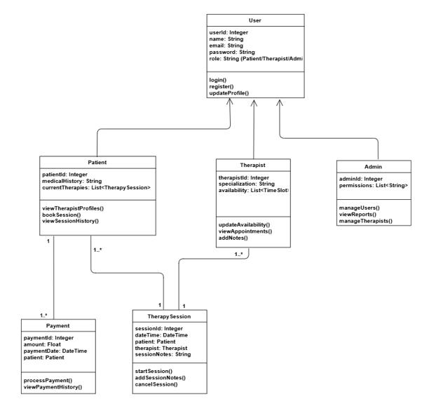

# Therapy Planner

Η εφαρμογή Therapy Planner στοχεύει στη βελτιστοποίηση της διαδικασίας προγραμματισμού ραντεβού σε ψυχολόγους.

## Οδηγίες μεταγλώττισης και εκτέλεσης της εφαρμογής
Η εφαρμογή έχει υλοποιηθεί με χρήση του εργαλείου δόμησης __Maven__ και μπορεί να χρησιμοποιηθεί εκτελώντας τις παρακάτω εντολές:
- **mvn clean package**: Για τη μεταγλώττιση.
- **mvn tomcat7:run**: Για την εκτέλεση του κώδικα. Στα αποτελέσματα εκτέλεσης μας δίνεται μία διεύθυνση url π.χ. _http://localhost:9090/TherapyPlanner_. Προσπελαύνουμε το συγκεκριμένο url σε φυλλομετρητή και περιηγούμαστε στην ιστοσελίδα.

Για την πλήρη λειτουργικότητα της εφαρμογής απαιτείται επιπλέον πριν από το παραπάνω βήμα:
- Η δημιουργία της βάσης δεδομένων σε κάποιο Database Management System εκτελώντας τις εντολές SQL του αρχείου database.sql (κατάλογος src/main/sql) και στη συνέχεια,
- Η δημιουργία των απαραίτητων μεταβλητών συστήματος για την πρόσβαση στη βάση. Συγκεκριμένα τις μεταβλητές:
    - **DB_URL**: URL για τη διευθυνση της βάσης δεδομένων: _jdbc:mysql://195.251.249.131:3306/ismgroup47_.
    - **DB_USERNAME**: Το όνομα χρήστη: *ismgroup47*.
    - **DB_PASSWORD**: Ο κωδικός πρόσβασης: *u6h7c6*.

## Προωθητικό video
Βρείτε περισσότερες πληροφορίες [εδώ](https://github.com/christinasiakavara/TherapyPlanner/raw/refs/heads/main/0117.mp4).

## Δομή του αποθετηρίου

Το αποθετήριο συγκροτείται από τους παρακάτω καταλόγους:

- **`TherapyPlanner/src/main/java/DETsCode`**: Περιέχει τον κώδικα της εφαρμογής.
    - **`DETsCode.TherapySession`**: Πακέτο για τη βασική δομή για τη διαχείριση ραντεβού θεραπείας.
    - **`DETsCode.User`**: Πακέτο για τη διαχείριση χρηστών.
        - **`DETsCode.Psychologist`**: Πακέτο για τη διαχείριση των ψυχολόγων.
            - **`DETsCode.Psychologist.service`**: Πακέτο για τη διαχείριση της λειτουργικότητας της κλάσης Psychologist.
        - **`DETsCode.Patient`**: Πακέτο για τη διαχείριση των θεραπευόμενων.
            - **`DETsCode.Patient.service`**: Πακέτο για τη διαχείριση της λειτουργικότητας της κλάσης Patient.
        - **`DETsCode.Payment`**: Πακέτο για τη διαχείριση πληρωμών.
            - **`DETsCode.Payment.service`**: Πακέτο για τη διαχείριση της λειτουργικότητας της κλάσης Payment.
        - **`DETsCode.Admin`**: Πακέτο για την διαχείριση των διαχειριστών.
            - **`DETsCode.Admin.service`**: Πακέτο για τη διαχείριση της λειτουργικότητας της κλάσης Admin.
    - **`DETsCode.Timeslot`**: Πακέτο για την διαχείρηση των προγραμμάτων.
    - **`DETsCode.ExtraFeatures.Chat`**: Πακέτο για τη διαχείριση των συνομιλιών μεταξύ ψυχολόγων και θεραπευόμενων.
        - **`DETsCode.ExtraFeatures.Chat.service`**: Πακέτο για τη διαχείριση της λειτουργικότητας της κλάσης Chat.
    - **`DETsCode.ExtraFeatures.Message`**: Πακέτο για τη διαχείριση των μηνυμάτων.
        - **`DETsCode.ExtraFeatures.Message.service`**: Πακέτο για τη διαχείριση της λειτουργικότητας της κλάσης Message.
- **`DETsCode.db`**: Πακέτο για τη διαχείριση της σύνδεσης του κώδικα της εφαρμογής με τον κώδικα της βάσης δεδομένων.
- **`TherapyPlanner/src/main/resources`**: Περιέχει αρχεία διαμόρφωσης της εφαρμογής.
- **`TherapyPlanner/src/test/java/DETsCode`**: Περιέχει τις μονάδες δοκιμών.
- **`TherapyPlanner/src/ExtraFeatures`**: Περιέχει επιπλέον αρχεία κώδικα των οποίων οι λειτουργίες δεν χρησιμοποιήθηκαν για την παράδοση της εργασίας
- **`pom.xml`**: Το Maven configuration αρχείο που διαχειρίζεται εξαρτήσεις και plugins.
- **`src/main/webapp/`**: Αρχεία JSP, CSS και JS για την εμφάνιση και την λειτουργία των ιστοσελίδων.
- **`TherapyPlanner/0117.mp4`**: Προωθητικό βίντεο της εφαρμογής.
- **`TherapyPlanner/image.png`**: Αρχείο με την εικόνα UML (δίνεται παρακάτω).

## Διάγραμμα UML σχετικά με το σχεδιασμό του κώδικα

## Επισκόπηση Δομών Δεδομένων και Αλγορίθμων

Η εφαρμογή χρησιμοποιεί διάφορες δομές δεδομένων και αλγόριθμους για την οργάνωση και τη λειτουργικότητά της. Παρακάτω παρουσιάζονται οι βασικές δομές δεδομένων και οι κύριοι αλγόριθμοι που έχουν υλοποιηθεί.

### Δομές Δεδομένων

- **Λίστες (`List`):** Αποθήκευση και διαχείριση συλλογών δεδομένων.
- **ArrayList (`ArrayList`):** Χρησιμοποιείται για την αποθήκευση λιστών στοιχείων, όπως οι συνεδρίες.
- **Τοπικές Ημερομηνίες (`LocalDateTime`)**: Αναπαριστά ημερομηνίες και ώρες για τον προγραμματισμό συνεδριών.

### Εργαλεία για τη διαχείριση της βάσης δεδομένων

- **PreparedStatement**: Για την εκτέλεση SQL εντολών με ασφάλεια.
- **ResultSet**: Για την ανάγνωση αποτελεσμάτων από τη βάση δεδομένων.
- **SQLException**: Για τη διαχείριση λαθών που σχετίζονται με τη βάση δεδομένων.

### Αλγόριθμοι

- **Έλεγχος Επικάλυψης Χρονικών Διαστημάτων:**
    - Υλοποιείται στην κλάση `Timeslot` μέσω της μεθόδου `overlaps()`, που συγκρίνει δύο χρονικά διαστήματα.
- **Ανάκτηση πληροφοριών από τη βάση δεδομένων:**
    - Στις κλάσεις `Patient` και `Psychologist`, με τη χρήση της μεθόδου `getAll()` ανακτάμε όλες τις αναγκαίες πληροφορίες σχετικά με τους ασθενείς και τους ψυχολόγους.
- **Έλεγχος Επικάλυψης Διαθεσιμότητας:**
    - Ο αλγόριθμος `validateTimeslot` στην κλάση Psychologist ελέγχει αν το επιλεγμένο χρονικό διάστημα στο πρόγραμμα του ψυχολόγου επικαλύπτεται με ήδη υπάρχων ραντεβού.
- **Εισαγωγή Νέου Ασθενούς:**
    - Η μέθοδος `insertpatient()` στην κλάση `PatientDAO` εισάγει έναν νέο ασθενή στη βάση δεδομένων.
- **Ανάθεση Ψυχολόγου σε Ασθενή:**
    - Η μέθοδος `insertPatientPsychologist()` στην κλάση `PatientDAO` αναθέτει έναν ψυχολόγο σε έναν ασθενή. Εκτυπώνεται μήνυμα καταγραφής χωρίς να αλληλεπιδρά άμεσα με τη βάση δεδομένων.
- **Κράτηση Συνεδρίας Θεραπείας:**
    - Η μέθοδος `bookSession()` στην κλάση `PatientService` ελέγχει τη διαθεσιμότητα του ψυχολόγου για την κράτηση μιας συνεδρίας θεραπείας.
- **Ανάκτηση πληρωμών:**
   - Ανακτά τις πληρωμές για έναν συγκεκριμένο ασθενή με βάση το `patientID` (μέθοδος `getPaymentsByPatientID` στην κλάση `PaymentDAO`).
- **Προσθήκη νέας πληρωμής:**:
   - Προσθέτει μια νέα πληρωμή στη βάση δεδομένων με τη μέθοδο `addPayment` (από την κλάση `PaymentDAO`).
